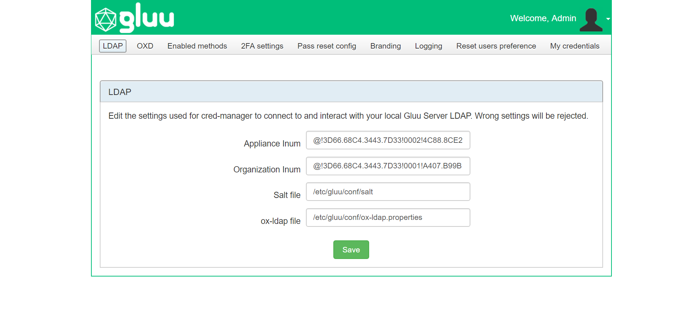
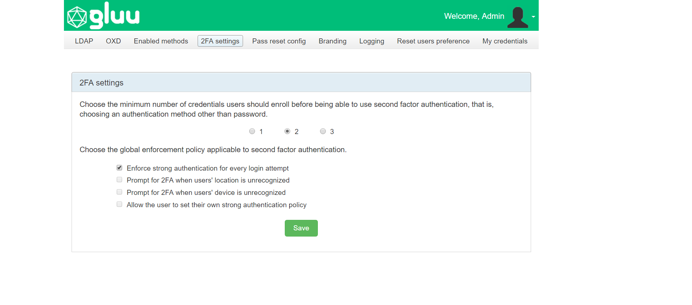
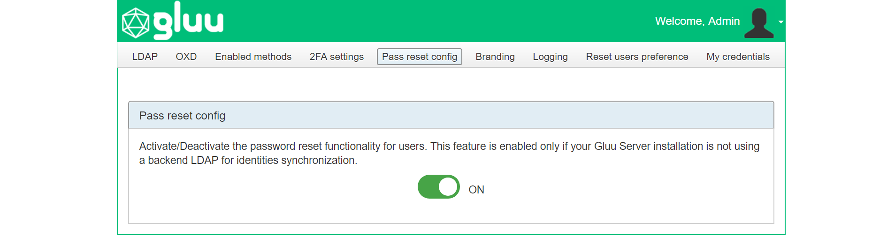
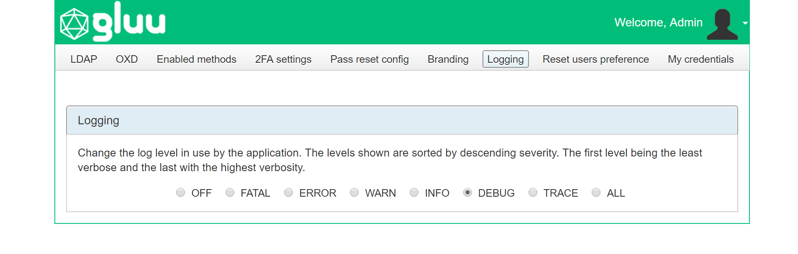

# Admin Console
The sections below document the admin console that is available to Credential Manager administrators after installation. Many of the settings are configured during initial setup. Once Credential Manager and Gluu are properly configured, follow the [enable methods section below](#enabled-methods) to "turn on" Cred Manager. 

## LDAP 

View the settings Credential Manager uses in order to establish a connection to the underlying LDAP. These settings are made by the application installer and there is no need to apply any change afterwards. Update these settings only if the application needs to be tested against a different LDAP Server. 

## oxd

Credential Manager leverages [oxd](https://oxd.gluu.org) to faciliate user authentication against its corresponding Gluu Server. oxd installation and configuration is prompted during Cred Manager installation. To change or update details about the oxd server, or to configure and use an existing oxd deployment, navigate to the `oxd` page in the admin console.

To add license information manually, or in case of lockout, visit the [FAQ document](./faq.md#oxd).

### oxd Settings
The following settings can be adjusted or viewed via the Credential Manager admin console:

- Connection Type: By default, oxd will connect to its corresponding Gluu Server via localhost ("oxd-server"). If oxd is installed on a standalone server, and has the https-extension enabled, the connection can be made over the web. If `oxd-server` is being used, a normal value would be `localhost`/ `8099`. If the `oxd-https-extension` is being used, the value will be something like `https://oxd.myorg.com:8443`. Learn more in the [oxd docs](https://gluu.org/docs/oxd). 

- URI of the OpenID Provider (OP): This is the URL of the corresponding Gluu Server where users are sent for authentication, e.g. `https://idp.myorg.com`. 

- Client Name: The name of the OpenID client that Credential Manager uses to facilitate SSO with the Gluu Server. <!--, e.g. `Credential Manager Production`.-->

- Authorization Redirect URI: This is the URL of the Credential Manager dashboard landing page that users are directed to after authentication. <!--, e.g. `https://idp.myorg.com/credentials`. -->

- Post logout URI: The URL of the page that users should be directed to after they log out of Credential Manager, e.g. `https://myorg.com`. 

- oxd ID: Upon setting up the Cred Manager client, the oxd ID will be automatically generated. It will look something like `2d88f886-0a8e-4249-af46-d47da0481349`

## Enabled Methods

Updates need to be made in both the Gluu Server and Credential Manager to get Credential Manager operational.

### Enable Authentication Scripts (Gluu)

The Gluu Server uses [interception scripts](https://gluu.org/docs/ce/admin-guide/custom-script/) to implement user authentication. For each type of 2FA credential that should be manageable in Credential Manager, the corresponding authentication script **must be** enabled in Gluu. 

To enable authentication methods in Gluu, open oxTrust and navigate to  `Configuration` > `Manage custom scripts`. Enable the interception script for each type of 2FA credential that should be manageable in Credential Manager - i.e. `u2f`, `super_gluu`, `otp`, and/or `twilio_sms`.  

To confirm script functionality, or if issues arise, check the [troubleshooting doc](./faq.md#troubleshooting-interception-scripts) in the FAQ.

It is advisable to refresh the interception script of Credential Manager every time new methods are enabled. This will help the script parse configurations of the accompanying scripts. To do this you can for instance disable and re-enable Credential Manager script, or do some harmless edition on the script contents, such as adding a new line or white space at the end. 

### Set Default Authentication Method (Gluu)
With the Credential Manager authentication script enabled in the Gluu Server, OpenID Connect clients can now request Credential Manager authentication (i.e. each users 2FA preference) using the standard OpenID Connect `acr_value`. 

To make each person's 2FA preference in Credential Manager the default authentication mechanism for all Gluu logins, navigate to `Configuration` > `Manage Authentication` > `Default Authentication method` and set `Default acr` and `oxTrust acr` to `credmanager`. Click update to save your changes. 

    
### Configure Cred Manager

Once the applicable interception scripts are enabled in Gluu, a Credential Manager admin can enable 2FA mechanisms in the `Enable methods` interface. Check the box for each type of authentication method users should be able to self-service in Credential Manager.

### Testing 

A recommended practice is to enable one script in the Gluu Server (like U2F), then enable the associated method in Cred Manager. Test and confirm that enrollment and authentication is working as expected, then continue adding other desired 2FA methods. In an incognito browser, employ a user other than `admin` to test enrollments each time a new method is added. This will prevent the `admin` user from being accidentally locked out.

## 2FA settings

In the 2FA settings, an admin can specify the minimum number of credentials a user **must** enroll before they are able to turn on 2FA, and choose from a few pre-defined policies for when 2FA should be prompted. 

To reduce the chance of lockout, we recommend setting a minimum of two (2) strong credentials. 

Predefined 2FA policy options include:

- Enforce strong authentication for every login attempt
- Prompt for 2FA when users' location is unrecognized
- Prompt for 2FA when users' device is unrecognized
- Allow the user to set their own strong authentication policy

The default policy is to enforce 2FA for every login attempt. If the admin opts to allow users to manager their own policy, a new widget will appear in the user-facing dashboard as described in the [user guide](../user-guide.md#2fa-settings--trusted-devices). 

## Pass reset config

If passwords are being stored in the Gluu Server (and not at an external backend directory server like AD), an admin can give users the ability to reset their password from inside credential manager. To enable the password reset functionality, navigate to `Pass reset config` and click the toggle to `ON`.  

## Branding

Most organizations will want to custom brand credential manager. Follow our guide to learn more about [custom branding cred manager](./custom-branding.md).

## Logging

Application logs are useful sources of information to diagnose anomalies and understand possible causes of errors if presented. Credential Manager uses the Log4J2 logging framework for this. The severity level for logs can be modified at runtime and requires no restart. For more information about logging, check the [FAQ entry](./faq.md#where-are-the-logs). 

## Reset Users Preference

If a user is locked out for any reason (e.g. lost device, etc.), an admin can navigate to `Reset users preference` in the admin console to reset the user's preferred method to password. Type the username (or part of) in the text field and then press search. Once the user has been located, click the checkbox and click the `Change to password` button. The row will become disabled, and a success message will be displayed.

