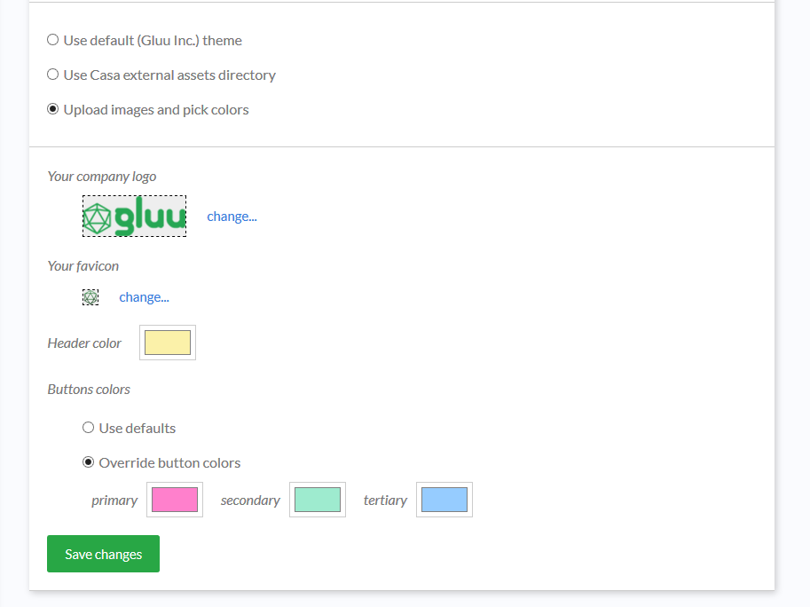

# Custom branding

Casa allows administrators to alter the application's appearance to match their organization's look and feel. There are two ways to tweak  appearance: a quick point-and-click set of changes that you can preview immediately, or a more low level approach which enables the possibility to supply your own CSS file and images (this is known as external assets directory usage). 

!!! Important:
    This page covers all existing customizations. Depending on the actual edition of Casa you are using (e.g CE or EE), some features may not be available in your installation.

## Quick design customization

Click on `Custom branding` in the admin console, and choose `Upload images and pick colors`. With this branding alternative you can apply a small but representative amount of visual changes effortlessly with zero CSS coding. You can:

* Supply your company logo and favicon
* Choose the background color for page header
* Choose buttons colors

Once you supply your files and/or color values, click on Save and see the changes take immediately by navigating to a different page or opening a new browser tab. Repeat the process till you get the combination that best matches your organization's look and feel.

With "Primary buttons" we refer to the vast majority of buttons that trigger some action such as saving, updating or accepting - whether in the user pages or the admin UI itself.  "Tertiary" conveys the meaning of undo, close or cancel, and "Secondary" for anything that does not fit any of the previous usages. 

You can choose "Use defaults" if you feel comfortable with the [boostrap-like](https://getbootstrap.com/docs/4.0/components/buttons/) colors offered in Gluu Casa.

## Using the external assets directory

!!! Note:
    Intermediate-level knowledge of CSS is required for this task.

TODO