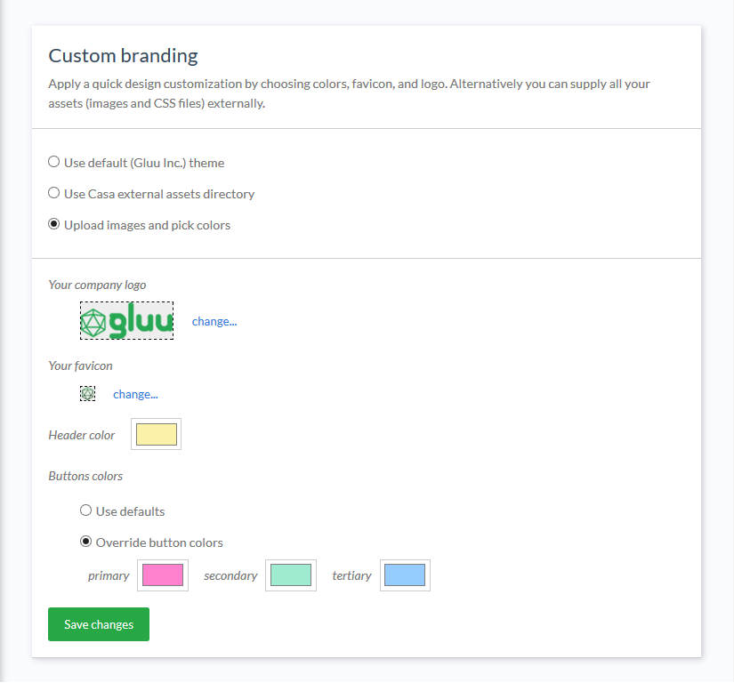
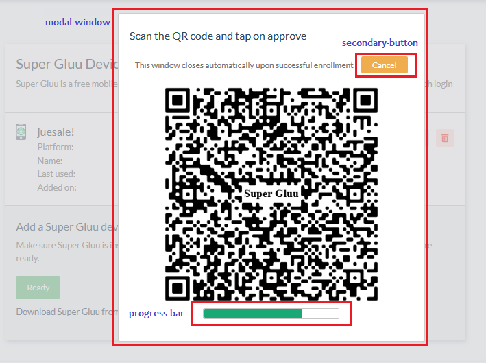

# Custom branding

Casa allows administrators to alter the application's appearance to match their organization's look and feel. There are two ways to tweak  appearance: a quick point-and-click set of changes that you can preview immediately, or a more low level approach which enables the possibility to supply your own CSS file and images (this is known as external assets directory usage). 

!!! Important:
    This page covers all existing customizations. Depending on the actual edition of Casa you are using (e.g CE or EE), some features may not be available in your installation.

## Quick design customization

Click on `Custom branding` in the admin console, and choose `Upload images and pick colors`. With this branding alternative you can apply a small but representative amount of visual changes effortlessly with zero CSS coding. You can:

* Supply your company logo and favicon
* Choose the background color for page header
* Choose buttons colors



Once you supply your files and/or color values, click on Save and see the changes take immediately by navigating to a different page or opening a new browser tab. Repeat the process till you get the combination that best matches your organization's look and feel.

With "Primary buttons" we refer to the vast majority of buttons that trigger some action such as saving, updating or accepting - whether in the user pages or the admin UI itself.  "Tertiary" conveys the meaning of undo, close or cancel, and "Secondary" for anything that does not fit any of the previous usages. 

You can choose "Use defaults" if you feel comfortable with the [boostrap-like](https://getbootstrap.com/docs/4.0/components/buttons/) colors offered in Gluu Casa.

## Using the external assets directory

!!! Note:
    Intermediate-level knowledge of CSS is required for this task.

### Background

UI design is driven by one CSS stylesheet and a few images. Specifically, Casa leverages the following UI frameworks:

* [ZK 8.5](http://books.zkoss.org/zk-mvvm-book/8.0/)
* [Bootstrap 4.1](https://getbootstrap.com/docs/4.0/getting-started/introduction/#quick-start)
* [Tachyons 4.11](http://tachyons.io)
* [Font awesome 5.2](https://fontawesome.com)

Particularly, ZK default theme CSS file was disabled to offer a higher degree of flexibility in design. This enables bootstrap and tachyons to claim control over style rules applied to HTML markup.

### External assets directory

In folder `/opt/gluu/jetty/casa/static` you can place your own version of the main stylesheet and images Casa uses. No other stylesheet should be overriden.

To start, login to chroot and do the following:

```
cd /opt/gluu/jetty/casa/static
jar -xf ../webapps/casa.war images styles/gluu/style.css  
```

This will copy the files you can edit later (these are the original versions provided out of the box in Casa).

If you were to include additional files into this directory, ensure ownership is correct, for instance you can do:

```
$ chown -R jetty:jetty /opt/gluu/jetty/casa/static/
```

### Enable and apply your customizations

In the admin console, click on `Custom branding`, and choose `Use Casa external assets directory`. From that point on, your installation is reading relevant files from the `static` directory.

!!! Note:
    In CSS, the rules order of appearance is important. Keep in mind that for all Casa pages, bootstrap is loaded first, then sytle.css, and finally tachyons.css. This means tachyons rules have higher prevalence overall unless there is usage of `!important` which is a disregarded practice.
    
Main stylesheet (`style.css`) is located at `/opt/gluu/jetty/casa/static/styles/gluu` if you have followed the instructions above.

Here are some tips to account when applying your customizations:

- Get some acquiantance with functional CSS. This is the approach followed in Casa. [Here](https://www.smashingmagazine.com/2013/10/challenging-css-best-practices-atomic-approach/), [here](https://css-tricks.com/lets-define-exactly-atomic-css/), and [here](https://johnpolacek.github.io/the-case-for-atomic-css/) you can find useful introductory material.

- Inspect the DOM tree generated for application pages and determine the CSS selectors you need to edit or the kind of things your have to add in order to alter the appearance. Use your web browser's facilities to inspect web page composition: this is usually part of any browser's developer toolbar. Moreover, they allow you to change styles on the fly so you can play a lot before applying the real changes.

- Don't override rules which are already defined in bootstrap or tachyons CSSs. Conversely, ZK rules (which are prefixed with `z-`) are safe to be re-defined since ZK CSS isn't included (actually `style.css` redefines some). 

- In most circumstances, your work will just reduce to editing existing rules in `style.css`. HTML markup will show rules (in `class` attribute) prefixed with `cust-` that are apparently not defined anywhere. These rules are intended to give users the opportunity to add their design tastes. The following is a list of custom selectors you can add to `style.css`. Names are in general self-explanatory, the images below help clarify more.

   - cust-menu-item
   - cust-content-heading
   - cust-sections-wrapper
   - cust-section
   - cust-panel
   - cust-modal-window
   - cust-edit-button
   - cust-link-button
   - cust-delete-button
   - cust-primary-button
   - cust-secondary-button
   - cust-tertiary-button
   - cust-text-input
   - cust-progress-bar
   




- Refrain from using `!important` unless you have no other alternative.

### Viewing your changes

There is no need to restart the application to visualize changes. However, most static files are cached by browsers, so you will need to clear the browser beforehand. The `shift+Ctrl+del` combination does the job in most cases. Leave the cookies option unchecked, so there is no need to log in after every refresh.

Alternatively, you can use a private browsing session.

If you tried the above and still not seeing changes, try hitting the resource URL directly in a new browser tab. For example, to load the `style.css` file in your browser, visit `https://<host-name>/casa/custom/styles/gluu/style.css`. That way, you can determine if your changes are there; if they are not, refresh with **`F5`**. If you still get the same content, you are not flushing cache properly. Close all tabs, empty the recent cache and try again.

### Reverting to Default Theme

If for any reason you wish to restore the default theme, select "Use default (Gluu Inc.) theme" in the admin dashboard.

### Examples

Here are solutions for common use cases:

### Use a different logo

Just replace file at `images/logo.png` (relative to `static` directory) with your own image.

### Use a Different Favicon

Replace `images/favicon.ico`.

### Change the Font Used in Text

The vast majority of text that appears in the application uses the same font. To set the default font, locate at the bottom of `style.css` a declaration like `@import url('https://fonts.googleapis.com...` and point to one of your choosing. Check this [page](https://developers.google.com/fonts/docs/getting_started) to learn more about Google fonts.

Then, scroll down and modify `html` and `body` selectors appropriately with the font you picked.

If you don't want to use Google fonts but one of your own, you can use `@font-face` for this purpose. Copy your `ttf`, `woff`, `svg` or `eot` files somewhere in `static` directory and link them appropriately.

To resort to the more classical fonts like "Helvetica", "Arial", etc., simply update `html` and `body` selectors passing the `font-family` name.
