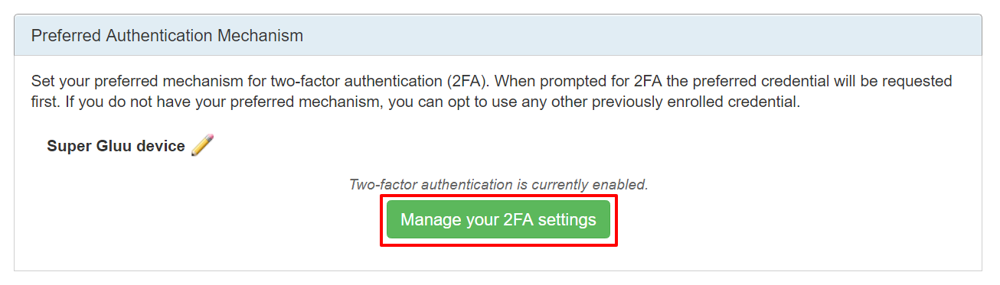

# User Guide - Gluu Casa

## Overview

Gluu Casa ("Casa") provides an interface for enrolling and managing a variety of free or low-cost two-factor authentication (2FA) credentials, including:
   
- U2F security keys (like [Yubikeys](https://www.yubico.com/products/yubikey-hardware/), or any [U2F key on Amazon](https://www.amazon.com/s/ref=nb_sb_noss_2?url=search-alias%3Daps&field-keywords=u2f))   
- Gluu's free and secure U2F mobile app, [Super Gluu](https://super.gluu.org)   
- OTP mobile apps (like Google Authenticator, FreeOTP, etc.)
- Physical OTP tokens (keyfobs, OTP cards)
- Mobile phone numbers that can receive OTPs via SMS

!!! Note
    Supported credentials are determined by the system administrator.

## Credential Dashboard

The credential dashboard displays widgets for each type of supported 2FA credential (e.g. U2F keys, OTP apps, etc.). Each widget includes summary details of enrolled credentials and a button to add / change credentials.

Click the button to view additional details and enroll new credentials.   

## Turn 2FA on/off

After the minimum number of credentials have been enrolled (as specified by the system admin), 2FA can be turned on by clicking the pencil icon in the preferred credential widget: 

Select the preferred type of 2FA and click `Update`:

When prompted for 2FA, the preferred credential will be requested _first_. If the preferred credential is not available, any other previously enrolled 2FA credential can be used. 

 

The context of an authentication attempt can determine which type of credental is most convenient to use. For instance, U2F keys are not compatible with mobile phones or non-Chrome browsers. **To reduce the chance of account lockout, we recommend having at least two different _types_ of 2FA credentials enrolled and accessible at all times** --e.g. one U2F token _and_ one OTP app, or one OTP app _and_ one SMS phone number. 

To turn off 2FA, set the preferred credential back to password. 

## 2FA settings & trusted devices
If enabled by the system administrator, people can set their own policies for when they should be prompted for 2FA. To manage your settings, after enrolling and turning 2FA on, click the `Manage your 2FA settings` button in the Preferred Authentication Mechanism widget. 

You will be able to choose from a few options for when 2FA is presented:

- Always (upon every login attempt)
- If the location (e.g. city) detected in the login attempt is unrecognized
- If the device used to login is unrecognized

If you opt for 2FA based on location, device, or both, a new widget will appear to display your trusted devices. 

## Credential Details & Enrollment

The details page provides additional details about each enrolled credential, for instance last used, mobile operating system, and device name. Nicknames can be edited, credentials can be deleted and new credentials can be enrolled and nicknamed. 

Follow the prompts to enroll, nickname and add new 2FA credentials.

!!! Warning  
    Deleting credentials cannot be undone. Deleting credentials may result in 2FA being turned off. 
