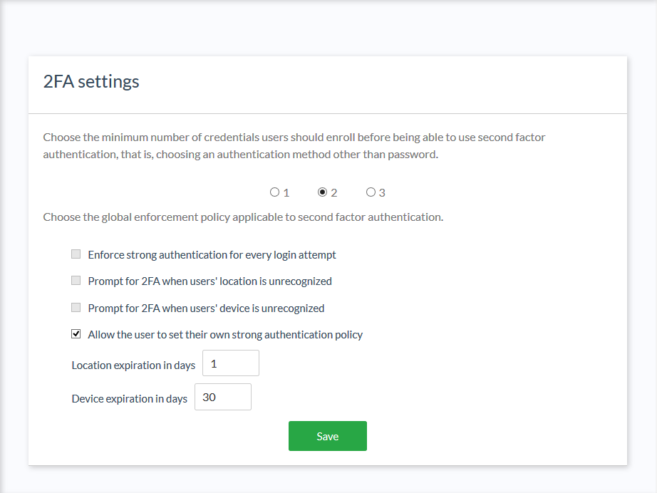
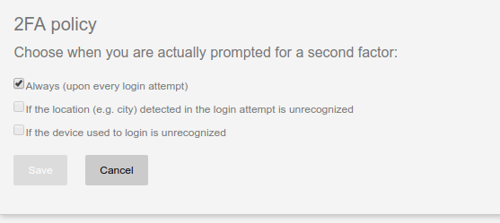

# 2FA Settings Plugin

## Overview
The 2FA Settings plugin offers administrators the ability to configure how and when 2FA is enforced. 

Using this plugin, admins can:

- Specify a minimum number of credentials users *must* enroll before they are able to turn on 2FA

- Choose from the following predefined policies for when 2FA should be enforced:
 
    - Always (every login attempt)
    - When user's location is unrecognized
    - When user's device is unrecognized
    - Users can define their own policy (using the above options)
  
- Set how long a location or device is deemed "recognized"
    
When admins allow users to set their own 2FA policy, users can additionally:

- View and remove "trusted devices" they have used to login (e.g. PC, tablet, phone)
- View time and location (city) details associated with previous login events

A device/location is considered trusted once the user has passed 2FA. Subsequent login attempts from trusted devices / locations will not require 2FA.

## Requirements

- The plugin jar file must match the version of your Casa (and Gluu Server) installation.
    
## Installation

1. [Download the plugin](https://gluu.co/2fa-settings-plugin)

1. Log in to Casa using an administrator account

1. Navigate to `Administration console` > `Casa plugins`

    

1. Click on `Add a plugin...` and select the plugin jar file

1. Click on `Add` 

## How to use

For administrators, a new link labeled "2FA settings" appears in the dashboard menu to access the function.

For regular users, proper details appear in the widget where preferred authentication mechanism is set. These will be visible only if an option other than "password only" has been selected.

