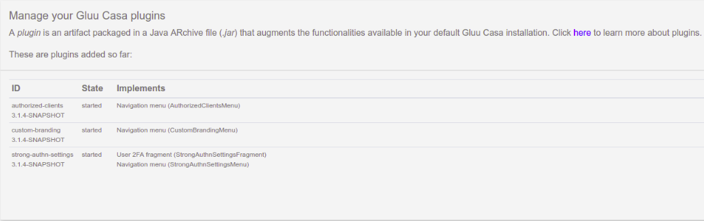

# Account Linking Plugin
## Overview
The Account Linking plugin allows users to link and delink their local account in the Gluu Server with an existing account at third-party social providers like GitHub, Facebook, and Google, or any other pre-configured external SAML or OpenID Connect Provider. 

## Workflows
Depending on how your authentication service is configured, users can either sign up for your service using an external account, or they can create a local account and link an external account post-registration. 

If a user signs up for your service using an external account, and later wants to "de-link" that account, before removing the account Casa will prompt the user to set a local password in your Gluu Server. Alternatively, the user can link another external account and then de-link the original account. More details [below](#social-login-enrollment).   

## Requirements

- A Gluu Server with Passport.js installed. [Install Gluu](https://gluu.org/docs/ce/installation-guide) 

- The plugin jar file that matches the version of your Casa and Gluu Server installation.

- Passport configured to support your target external authentication providers, e.g. GitHub, Google, etc. Check the Gluu Server docs for instructions (make sure the docs version matches your Gluu version):

    - [Inbound SAML](https://www.gluu.org/docs/ce/3.1.6/authn-guide/inbound-saml-passport/)    
    - [Inbound OAuth/OIDC](https://www.gluu.org/docs/ce/3.1.6/authn-guide/passport/)   
  
## Installation

Once you have configured and tested the integration(s) with the target external providers, install the Accounts Linking plugin by following the steps below:

1. [Download the plugin](https://gluu.co/account-linking-plugin)

1. Log in to Casa using an administrator account

1. Visit `Administration console` > `Casa plugins`

    

1. Click on `Add a plugin...` and select the plugin jar file

1. Click on `Add` 

Now users will see an "Accounts linking" menu item added in their navigation where they can link and unlink their local account with pre-configured external authentication providers. 

## Social login enrollment 

If you want to support inbound identity for new user enrollment, the following instructions apply. 

When a user logs in for the first time through an external provider, a new user entry (local account) is created in the Gluu Server linked to the provider. A user won't be able to de-link the account they used to sign up until they either:

1. Set a local password: the plugin bundles a form that allows users to perform this action;  
1. Link an additional external account.  

Follow the instructions below to configure your Gluu and Casa instances to leverage existing user credentials at external providers.

### Add custom parameters

In your Gluu Server, add a custom parameter for authorization requests: 

1. In oxTrust go to `Configuration` > `JSON Configuration` > `oxAuth Configuration`

1. Under `authorizationRequestCustomAllowedParameters`, add one item. Choose a name for it, such as `custParamCasaPassport`

1. Press the save button at the bottom of the page

!!! Note
    By default every time a user logs in via a external provider, an update takes place in his profile: all attributes released from the external provider to oxAuth are updated in local LDAP. Attributes not received are flushed. If you don't want the update to take place, please also add a oxAuth custom param with name `skipPassportProfileUpdate`.

### Activate the custom scripts needed

While configuring Passport earlier, you enabled one or more authentication scripts (ie. `passport_social`/`passport_saml`). 

In oxTrust, navigate to `Configuration` > `Manage custom scripts` and for every script you enabled, add a configuration parameter with name `authz_req_param_provider` and set its value to the custom authorization parameter created earlier (e.g. `custParamCasaPassport`).

### Update Casa custom script

Since the *standard* authentication flow will be different, the `casa` script contents must be updated. Expand the row corresponding to Casa script, back up the current script contents and then replace with those found [here](https://github.com/GluuFederation/casa-ee-plugins/raw/version_3.1.6/account-linking/extras/casa.py).

Press the update button at the bottom of the page.

The login page must be updated so it dynamically loads the external providers in a way that users can choose a provider to log in/create an account:

1. Log in to the chroot
1. `cd` to `/opt/gluu/jetty/oxauth/custom/pages`
1. Copy the file found [here](https://github.com/GluuFederation/casa-ee-plugins/raw/version_3.1.6/account-linking/extras/casa.xhtml) into `pages` folder.

## User guide

For information on how to use the plugin, see the [User Guide](../user-guide.md)
