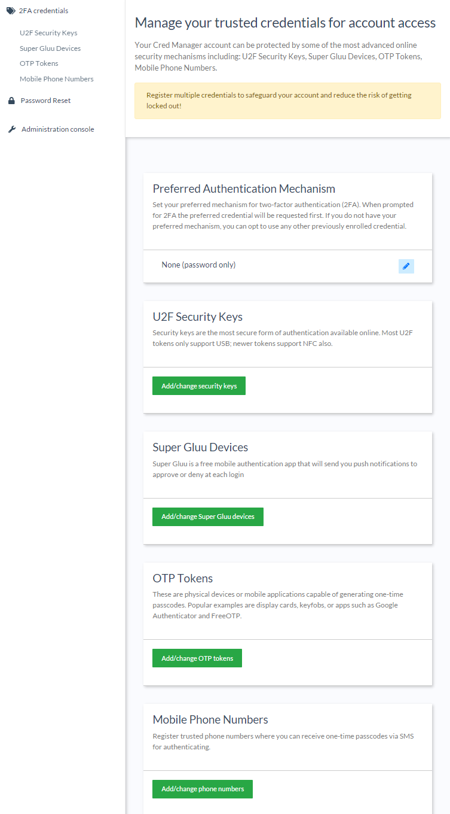
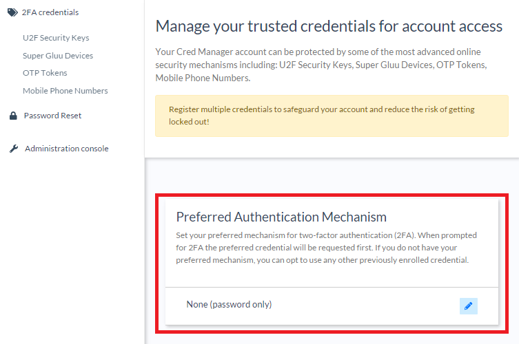
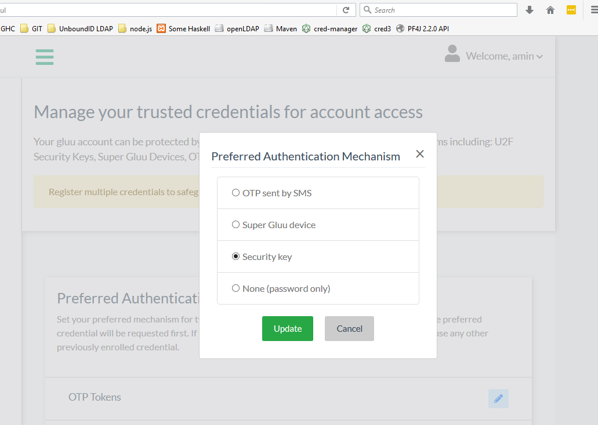

# User Guide - Gluu Casa

## Overview

Gluu Casa ("Casa") provides an interface for enrolling and managing a variety of free or low-cost two-factor authentication (2FA) credentials, including:
   
- U2F security keys (like [Yubikeys](https://www.yubico.com/products/yubikey-hardware/), or any [U2F key on Amazon](https://www.amazon.com/s/ref=nb_sb_noss_2?url=search-alias%3Daps&field-keywords=u2f))   
- Gluu's free and secure U2F mobile app, [Super Gluu](https://super.gluu.org)   
- OTP mobile apps (like Google Authenticator, FreeOTP, etc.)
- Physical OTP tokens (keyfobs, OTP cards)
- Mobile phone numbers that can receive OTPs via SMS

!!! Note
    Supported credentials are determined by the system administrator.

## Logging in for the first time

To log in to Casa, navigate to `https://<yourdomain>/casa`.

If you already have an account in the corresponding Gluu Server, log in to Casa by entering the username and password here. 

### Signing in with a linked account

If the administrator has enabled the Account Linking plugin, a list with the configured providers will be displayed on the right panel. Click on an entry to access the given provider's authentication process. After this is finished, you will be taken back to Casa.

Note that users without a local password set yet don't have access to enroll credentials because the username + password combination is  a prerequisite for multi-factor authentication. The user will be prompted to create a new password.

## Credential Dashboard

The credential dashboard displays widgets for each type of supported 2FA credential (e.g. U2F keys, OTP apps, etc.). Each widget includes summary details of enrolled credentials and a button to add / change credentials.

To manage existing credentials and enroll new credentials, click the `Manage` button: 

## 2FA

### Turn 2FA on/off

After the minimum number of credentials have been enrolled (as specified by the system admin), 2FA can be turned on by clicking the pencil icon in the preferred credential widget: 

Select the preferred type of 2FA and click `Update`:

When prompted for 2FA, the preferred credential will be requested _first_. If the preferred credential is not available, any other previously enrolled 2FA credential can be used. 

 

The context of an authentication attempt can determine which type of credental is most convenient to use. For instance, U2F keys are not compatible with mobile phones or non-Chrome browsers. **To reduce the chance of account lockout, we recommend having at least two different _types_ of 2FA credentials enrolled and accessible at all times** --e.g. one U2F token _and_ one OTP app, or one OTP app _and_ one SMS phone number. 

To turn off 2FA, set the preferred credential back to password. 

### 2FA settings & trusted devices
If enabled by the system administrator, people can set their own policies for when they should be prompted for 2FA. To manage your settings, after enrolling and turning 2FA on, click the `Manage your 2FA settings` button in the Preferred Authentication Mechanism widget. 

You will be able to choose from a few options for when 2FA is presented:

- Always (upon every login attempt)
- If the location (e.g. city) detected in the login attempt is unrecognized
- If the device used to login is unrecognized

If you opt for 2FA based on location, device, or both, a new widget will appear to display your trusted devices. 

### Credential Details & Enrollment

The details page provides additional details about each enrolled credential, for instance last used, mobile operating system, and device name. Nicknames can be edited, credentials can be deleted and new credentials can be enrolled and nicknamed. 

#### U2F Keys

To add a new U2F credential, navigate to `2FA credentials` > `U2F Security Keys`. Insert the U2F key and click `Ready`. Casa will prompt to press the button on the U2F key.

Add a nickname and click `Add`.

Once it's added, the new device will appear in a list on the same page. Click the pencil to edit the device's nickname or the trashcan to delete the device.

!!! Warning  
    When a credential is deleted, it cannot be recovered. Deleting credentials may result in 2FA being turned off. 
    
#### Super Gluu Devices

To add a new Super Gluu device, navigate to `2FA credentials` > `Super Gluu Devices`.

The Super Gluu enrollment QR code will pop up. Scan it in the Super Gluu app and approve the enrollment.

Add a nickname for the device and click `Add`.

Once it's added, the new device will appear in a list on the same page. Click the pencil to edit the device's nickname or the trashcan to delete the device.

!!! Warning  
    When a credential is deleted, it cannot be recovered. Deleting credentials may result in 2FA being turned off. 
    
#### OTP Tokens

To add a new OTP token, navigate to `2FA credentials` > `OTP Tokens`.

To add a soft OTP token, choose the `Soft token` option and follow the same steps as [Super Gluu](#super-gluu-devices).

For a hard token, choose the `Hard Token` option.

Add the key associated with the device and the 6 digit code. Add a nickname for the device and click `Add`.

Once it's added, the new device will appear in a list on the same page. Click the pencil to edit the device's nickname or the trashcan to delete the device.

!!! Warning  
    When a credential is deleted, it cannot be recovered. Deleting credentials may result in 2FA being turned off.
    
#### Mobile Phone Numbers

To add a new mobile phone number for one-time passcodes, navigate to `2FA credentials` > `Mobile Phone Numbers`.

Enter a phone number and click 'Send SMS' to get the passcode. Enter the code received, nickname the mobile number, and click `Add`.

Once it's added, the new mobile number will appear in a list on the same page. Click the pencil to edit the mobile number's nickname or the trashcan to delete the mobile number.

!!! Warning  
    When a credential is deleted, it cannot be recovered. Deleting credentials may result in 2FA being turned off.
    
## Managing linked accounts

To manage accounts linked to outside sources, navigate to `Account Linking` on the left-hand menu.

This presents the option to link new accounts, or edit existing linked accounts.

Once an account is linked, it can be removed when necessary.

